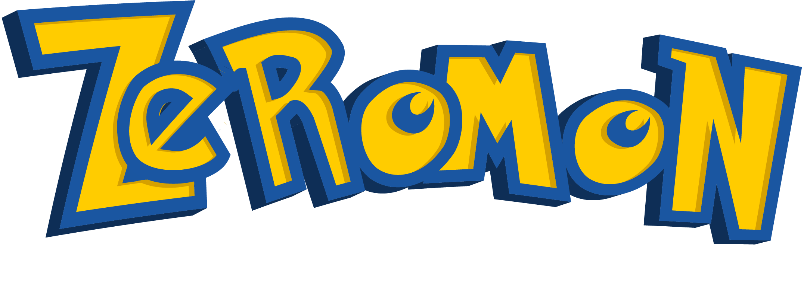
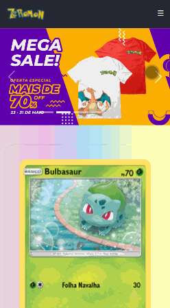
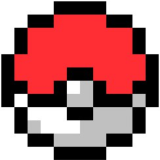
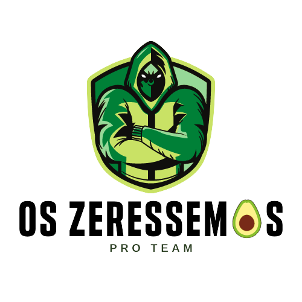

<!-- ALL-CONTRIBUTORS-BADGE:START - Do not remove or modify this section -->

<!-- ALL-CONTRIBUTORS-BADGE:END -->
<a name="back-to-top">

<i>Projeto feito pelo grupo Zeréssimos como requisito parcial da disciplina Front-end, da Residência de Software do Serratec.</i>

<i>Professor Yuri Umbreon Weilemann</i>💚<i>, o brabo.</i>

  

    
        
       
      
  

  
  

## &nbsp;&nbsp;&nbsp;&nbsp;&nbsp;&nbsp;&nbsp;&nbsp;&nbsp;&nbsp;&nbsp;&nbsp;&nbsp;&nbsp;&nbsp;&nbsp;&nbsp;&nbsp;&nbsp;&nbsp;&nbsp;&nbsp;&nbsp;&nbsp;&nbsp;&nbsp;&nbsp;&nbsp;&nbsp;&nbsp;&nbsp;Navegador&nbsp;&nbsp;&nbsp;&nbsp;&nbsp;&nbsp;&nbsp;&nbsp;&nbsp;&nbsp;&nbsp;&nbsp;&nbsp;&nbsp;&nbsp;&nbsp;&nbsp;&nbsp;&nbsp;&nbsp;&nbsp;&nbsp;&nbsp;&nbsp;&nbsp;&nbsp;&nbsp;&nbsp;&nbsp;&nbsp;&nbsp;&nbsp;&nbsp;&nbsp;&nbsp;&nbsp;&nbsp;&nbsp;&nbsp;&nbsp;&nbsp;&nbsp;&nbsp;Mobile

&nbsp;&nbsp;

  
##     Projeto Final 
 &nbsp;&nbsp;&nbsp;&nbsp;&nbsp;&nbsp;**Zeromom Market Place**    [*(Enunciado)*](materialDeAula/confidential.pdf)
 * [**Site**](https://zeromon.vercel.app/)
 * [**Vídeo**](https://www.linkedin.com/embed/feed/update/urn:li:ugcPost:6802816921575288832?compact=1)
 * [**Instagram**](https://www.instagram.com/zeressemos_company/)
 * [**Repositório**](zeromonMarketPlace/)
  

## Tecnologia Utilizada
- [**CSS**](https://www.w3.org/Style/CSS/)    [(*Documentação MDN*)](https://developer.mozilla.org/en-US/docs/Web/CSS/Reference)
- [**HTML5**](https://html.spec.whatwg.org/)    [(*Documentação MDN*)](https://developer.mozilla.org/pt-BR/docs/Web/HTML)
- [**JavaScript**](https://www.javascript.com/)    [(*Documentação MDN*)](https://developer.mozilla.org/pt-BR/docs/Web/JavaScript)
- [**Visual Studio Code**](https://code.visualstudio.com/)    [*(Documentação)*](https://code.visualstudio.com/docs)

- [**PokéAPI**](https://pokeapi.co/)    [(*Documentação*)](https://pokeapi.co/docs/v2)

   

<table>
  <tr>
    <td align="center">
      <a href="https://github.com/raiocodrigues">
         
        
          <b>Caio Rodrigues</b>
        
      </a>
    </td>
    <td align="center">
      <a href="https://github.com/FredericoStilpen">
         
        
          <b>Frederico Stilpen</b>
        
      </a> 
    </td>
    <td align="center">
      <a href="https://github.com/M4G1Ck">
         
        
          <b>Gabriel Macedo Araújoo</b>
        
      </a> 
    </td>
    <td align="center">
      <a href="https://github.com/JpBade">
         
        
          <b>João Paulo Bade</b>
        
      </a> 
    </td>
    <td align="center">
      <a href="https://github.com/marcosbarker">
         
        
          <b>Marcos Paulo Marques Corrêa</b>
        
      </a> 
    </td>
    <td align="center">
      <a href="https://github.com/Volneineves">
         
        
          <b>Volnei Neves</b>
        
      </a> 
    </td>
</table>

## Contributors ✨

Thanks goes to these wonderful people ([emoji key](https://allcontributors.org/docs/en/emoji-key)):

<!-- ALL-CONTRIBUTORS-LIST:START - Do not remove or modify this section -->
<!-- prettier-ignore-start -->
<!-- markdownlint-disable -->
<table>
  <tr>
    <td align="center"><a href="http://linktr.ee/marcos_barker"> <b>Marcos Paulo Marques Corrêa </b></a> <a href="https://github.com/OsZeressemos/zeromonMarketPlace/commits?author=marcosbarker" title="Code">💻</a></td>
    <td align="center"><a href="https://github.com/JpBade"> <b>João Paulo Bade</b></a> <a href="https://github.com/OsZeressemos/zeromonMarketPlace/commits?author=JpBade" title="Code">💻</a></td>

    <td align="center"><a href="https://github.com/M4G1Ck"> <b>Gabriel Macedo Araújo</b></a> <a href="https://github.com/OsZeressemos/zeromonMarketPlace/commits?author=M4G1Ck" title="Code">💻</a></td>

    <td align="center"><a href="https://github.com/FredericoStilpen"> <b>FredericoStilpen</b></a> <a href="https://github.com/OsZeressemos/zeromonMarketPlace/commits?author=FredericoStilpen" title="Code">💻</a></td>

    <td align="center"><a href="https://github.com/raiocodrigues"> <b>Caio Rodrigues</b></a> <a href="https://github.com/OsZeressemos/zeromonMarketPlace/commits?author=raiocodrigues" title="Code">💻</a></td>

  </tr>
</table>

<!-- markdownlint-restore -->
<!-- prettier-ignore-end -->

<!-- ALL-CONTRIBUTORS-LIST:END -->

This project follows the [all-contributors](https://github.com/all-contributors/all-contributors) specification. Contributions of any kind welcome!